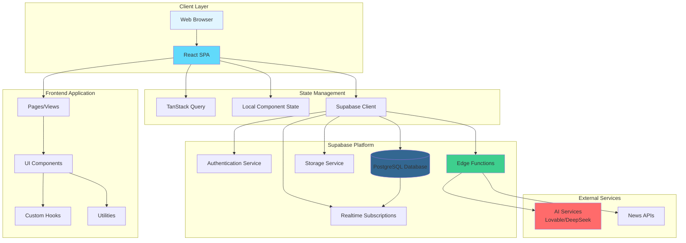

# Stone Path AI Hub - Architecture Documentation

Welcome to the architecture documentation for **Stone Path AI Hub**, a comprehensive high school student support platform.

## Quick Navigation

This documentation is organized into focused sections:

1. **[Frontend Architecture](FRONTEND.md)** - React components, pages, UI library, and frontend patterns
2. **[Backend Architecture](BACKEND.md)** - Supabase services, Edge Functions, APIs, authentication, and deployment
3. **[Database Schema](DATABASE.md)** - Complete database schema, tables, relationships, and RLS policies

## System Overview

**Stone Path AI Hub** is a comprehensive high school student support platform that provides assistance across eight key life pillars:
- Career Development
- Mental Health
- Academics
- Friendships
- Relationships
- Peer Support (Bullying)
- Fitness
- Finance

The platform uses AI-powered features to provide personalized guidance, task management, mood tracking, and various educational tools.

## High-Level Architecture



## Technology Stack

### Frontend
- **Framework**: React 18.3.1 with TypeScript 5.8.3
- **Build Tool**: Vite 5.4.19
- **UI Library**: shadcn/ui (Radix UI primitives)
- **Styling**: Tailwind CSS 3.4.17
- **State Management**: TanStack Query (React Query) 5.83.0
- **Routing**: React Router DOM 6.30.1
- **Form Handling**: React Hook Form 7.61.1 + Zod 3.25.76

### Backend
- **BaaS**: Supabase (PostgreSQL + Edge Functions)
- **Runtime**: Deno (for Edge Functions)
- **Database**: PostgreSQL (via Supabase)
- **Authentication**: Supabase Auth
- **Real-time**: Supabase Realtime (WebSocket)

### External Services
- **AI Provider**: Lovable AI Gateway (Gemini 2.5 Flash) / DeepSeek
- **News API**: External news sources

## Key Features

### Eight Support Pillars

1. **Career Development** - Career assessments, resume building, interview coaching
2. **Mental Health** - Mood tracking, wellness tips, counselor requests
3. **Academics** - Assignment management, AI note generation, Pomodoro timer
4. **Friendships** - Group management, real-time chat, event planning
5. **Relationships** - Anonymous Q&A, relationship guidance
6. **Peer Support** - Bullying reports, mentor matching
7. **Fitness** - Workout logging, streak tracking
8. **Finance** - Budget management, transaction tracking, savings goals

### Core Capabilities

- **AI-Powered Features**: Chat assistant, note generation, quiz creation, career insights
- **Real-time Collaboration**: Group chat, event coordination, availability scheduling
- **Task Management**: Assignment tracking, calendar views, priority management
- **Data Visualization**: Mood charts, budget analytics, fitness streaks
- **Privacy & Security**: Row-level security, anonymous reporting, secure authentication

## Key Architectural Decisions

1. **Supabase as BaaS**: Eliminates need for separate backend server, provides auth, database, and serverless functions
2. **React Query**: Efficient data fetching, caching, and synchronization
3. **shadcn/ui**: Accessible, customizable component library
4. **TypeScript**: Type safety across frontend and generated DB types
5. **Edge Functions**: Serverless AI processing close to users
6. **RLS**: Database-level security ensures data isolation
7. **Real-time**: WebSocket connections for live updates (groups, chat)
8. **Streaming AI**: SSE for real-time AI responses

## Documentation Structure

### [Frontend Architecture](FRONTEND.md)
- Page structure and routing
- Component hierarchy
- UI component library (40 and more components)
- State management patterns
- Form handling and validation
- Real-time features

### [Backend Architecture](BACKEND.md)
- Supabase platform services
- Edge Functions (14 functions)
- Authentication & authorization
- API integrations
- Data flow diagrams
- Deployment architecture
- Security considerations

### [Database Schema](DATABASE.md)
- Complete ER diagram (20 tables)
- Table inventory by domain
- Relationships and foreign keys
- Row Level Security (RLS) policies
- Database functions
- Migration files

## Project Structure

```
stonepath-ai-hub-main/
├── src/
│   ├── App.tsx                 # Root component, routing setup
│   ├── main.tsx                # Entry point
│   ├── pages/                  # Route components (11 pages)
│   ├── components/             # Feature components (15+)
│   │   ├── ui/                 # shadcn/ui components (40+)
│   │   └── [Feature components]
│   ├── hooks/                  # Custom React hooks
│   ├── integrations/
│   │   └── supabase/
│   │       ├── client.ts       # Supabase client setup
│   │       └── types.ts        # Generated DB types
│   └── lib/
│       └── utils.ts            # Utility functions
├── supabase/
│   ├── functions/              # Edge Functions (14)
│   └── migrations/             # Database migrations (15)
├── public/                     # Static assets
├── ARCHITECTURE.md             # This file (overview)
├── FRONTEND.md                 # Frontend documentation
├── BACKEND.md                  # Backend documentation
└── DATABASE.md                 # Database documentation
```

## Quick Stats

- **Pages**: 11 route components
- **Feature Components**: 15+ custom components
- **UI Components**: 40+ shadcn/ui components
- **Database Tables**: 20 tables
- **Edge Functions**: 14 serverless functions
- **Database Migrations**: 15 migration files

## Future Enhancements

- [ ] Mobile app (React Native)
- [ ] Offline support (PWA)
- [ ] Advanced analytics dashboard
- [ ] Multi-language support
- [ ] Integration with school systems
- [ ] Advanced AI features (personalized recommendations)
- [ ] Video/voice chat for groups
- [ ] File upload and sharing

---

*Last Updated: Based on current codebase structure*  
*Version: 1.0.0*
