# Stone Path AI Hub - Architecture Documentation

## Table of Contents
1. [System Overview](#system-overview)
2. [Technology Stack](#technology-stack)
3. [High-Level Architecture](#high-level-architecture)
4. [Frontend Architecture](#frontend-architecture)
5. [Backend Architecture](#backend-architecture)
6. [Database Schema](#database-schema)
7. [Edge Functions](#edge-functions)
8. [Data Flow](#data-flow)
9. [Authentication & Authorization](#authentication--authorization)
10. [Component Structure](#component-structure)
11. [API Integrations](#api-integrations)
12. [Deployment Architecture](#deployment-architecture)

---

## System Overview

**Stone Path AI Hub** is a comprehensive high school student support platform that provides assistance across eight key life pillars:
- Career Development
- Mental Health
- Academics
- Friendships
- Relationships
- Peer Support (Bullying)
- Fitness
- Finance

The platform uses AI-powered features to provide personalized guidance, task management, mood tracking, and various educational tools.

---

## Technology Stack

### Frontend
- **Framework**: React 18.3.1
- **Language**: TypeScript 5.8.3
- **Build Tool**: Vite 5.4.19
- **UI Library**: shadcn/ui (Radix UI primitives)
- **Styling**: Tailwind CSS 3.4.17
- **State Management**: TanStack Query (React Query) 5.83.0
- **Routing**: React Router DOM 6.30.1
- **Form Handling**: React Hook Form 7.61.1 + Zod 3.25.76
- **Charts**: Recharts 2.15.4
- **Drag & Drop**: @dnd-kit/core 6.3.1
- **Themes**: next-themes 0.3.0

### Backend
- **BaaS**: Supabase (PostgreSQL + Edge Functions)
- **Runtime**: Deno (for Edge Functions)
- **Database**: PostgreSQL (via Supabase)
- **Authentication**: Supabase Auth
- **Storage**: Supabase Storage (if used)

### External Services
- **AI Provider**: Lovable AI Gateway (Gemini 2.5 Flash) / DeepSeek
- **News API**: External news sources
- **PDF Processing**: pdfjs-dist 5.4.449

---

## High-Level Architecture

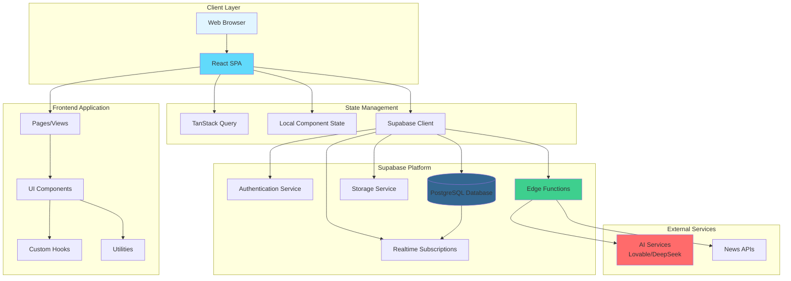

---

## Frontend Architecture

### Page Structure

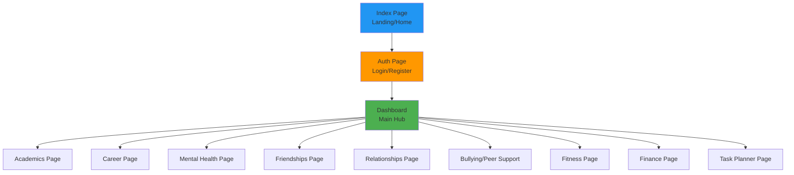

### Component Hierarchy

```mermaid
graph TB
    subgraph "App Level"
        App[App.tsx<br/>Root Component]
        Router[React Router]
        QueryProvider[QueryClientProvider]
        ToastProvider[Toast Providers]
    end

    subgraph "Pages"
        Dashboard
        Academics
        Career
        MentalHealth
        Friendships
        Relationships
        Bullying
        Fitness
        Finance
        TaskPlanner
    end

    subgraph "Feature Components"
        AiChatDialog[AI Chat Dialog]
        AssignmentForm[Assignment Form]
        AssignmentList[Assignment List]
        AssignmentCalendar[Assignment Calendar]
        PomodoroTimer[Pomodoro Timer]
        AiNoteGenerator[AI Note Generator]
        MoodTracker[Mood Tracker]
        MoodChart[Mood Chart]
        QuizGame[Quiz Game]
        ResumeBuilder[Resume Builder]
        NewsCarousel[News Carousel]
        GroupList[Group List]
        GroupChat[Group Chat]
        GroupEvents[Group Events]
        GroupAvailability[Group Availability]
        UserAvailability[User Availability]
    end

    subgraph "UI Components (shadcn/ui)"
        UI[40+ UI Components<br/>Button, Card, Dialog, etc.]
    end

    App --> Router
    App --> QueryProvider
    App --> ToastProvider
    
    Router --> Dashboard
    Router --> Academics
    Router --> Career
    Router --> MentalHealth
    Router --> Friendships
    Router --> Relationships
    Router --> Bullying
    Router --> Fitness
    Router --> Finance
    Router --> TaskPlanner
    
    Dashboard --> AiChatDialog
    Dashboard --> NewsCarousel
    
    Academics --> AssignmentForm
    Academics --> AssignmentList
    Academics --> AssignmentCalendar
    Academics --> PomodoroTimer
    Academics --> AiNoteGenerator
    
    MentalHealth --> MoodTracker
    MentalHealth --> MoodChart
    
    Career --> QuizGame
    Career --> ResumeBuilder
    
    Friendships --> GroupList
    Friendships --> GroupChat
    Friendships --> GroupEvents
    Friendships --> GroupAvailability
    
    FeatureComponents --> UI

    style App fill:#61dafb
    style Dashboard fill:#4CAF50
    style UI fill:#9C27B0
```

---

## Backend Architecture

### Supabase Services

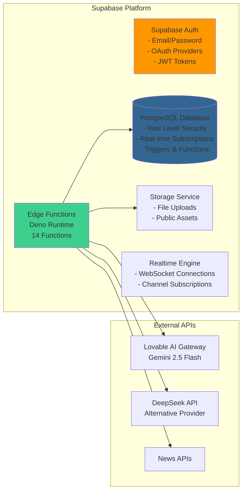

---

## Database Schema

### Complete Database Schema

```mermaid
erDiagram
    USERS ||--o{ ASSIGNMENTS : creates
    USERS ||--o{ MOOD_ENTRIES : tracks
    USERS ||--o{ BUDGET_CATEGORIES : manages
    USERS ||--o{ TRANSACTIONS : records
    USERS ||--o{ CAREER_QUIZ_RESULTS : takes
    USERS ||--o{ GROUPS : creates
    USERS ||--o{ GROUP_MEMBERS : joins
    USERS ||--o{ USER_AVAILABILITY : sets
    USERS ||--o{ WORKOUT_LOGS : logs
    USERS ||--o{ FITNESS_STREAKS : tracks
    USERS ||--o{ CHORES : creates
    USERS ||--o{ CHORE_COMPLETIONS : completes
    USERS ||--o{ SAVINGS_GOALS : sets
    USERS ||--o{ PROFILES : has
    USERS ||--o{ COUNSELOR_REQUESTS : requests
    USERS ||--o{ MENTOR_REQUESTS : requests
    
    GROUPS ||--o{ GROUP_MEMBERS : contains
    GROUPS ||--o{ GROUP_MESSAGES : has
    GROUPS ||--o{ GROUP_EVENTS : has
    
    GROUP_EVENTS ||--o{ EVENT_RSVPS : receives
    
    BUDGET_CATEGORIES ||--o{ TRANSACTIONS : categorizes
    
    CHORES ||--o{ CHORE_COMPLETIONS : tracks
    
    ASSIGNMENTS {
        uuid id PK
        uuid user_id FK
        string title
        string description
        timestamp due_date
        string subject
        string priority
        string status
        string type
        timestamp created_at
        timestamp updated_at
    }
    
    MOOD_ENTRIES {
        uuid id PK
        uuid user_id FK
        integer mood_level "0-6"
        text_array feelings
        text_array impact_factors
        timestamp created_at
    }
    
    BUDGET_CATEGORIES {
        uuid id PK
        uuid user_id FK
        string name
        string type
        decimal monthly_budget
        string color
        timestamp created_at
    }
    
    TRANSACTIONS {
        uuid id PK
        uuid user_id FK
        uuid category_id FK
        decimal amount
        string description
        string type
        date transaction_date
        timestamp created_at
    }
    
    CAREER_QUIZ_RESULTS {
        uuid id PK
        uuid user_id FK
        jsonb answers
        string result_type
        text feedback
        jsonb recommended_careers
        jsonb recommended_clubs
        text quote
        timestamp created_at
    }
    
    GROUPS {
        uuid id PK
        uuid created_by FK
        string name
        string category
        text description
        boolean is_public
        integer max_members
        timestamp created_at
        timestamp updated_at
    }
    
    GROUP_MEMBERS {
        uuid id PK
        uuid group_id FK
        uuid user_id FK
        string role "admin, member"
        timestamp joined_at
    }
    
    GROUP_MESSAGES {
        uuid id PK
        uuid group_id FK
        uuid user_id FK
        text content
        string image_url
        boolean is_moderated
        timestamp created_at
    }
    
    GROUP_EVENTS {
        uuid id PK
        uuid group_id FK
        uuid created_by FK
        string title
        text description
        timestamp event_date
        string location
        timestamp created_at
        timestamp updated_at
    }
    
    EVENT_RSVPS {
        uuid id PK
        uuid event_id FK
        uuid user_id FK
        string status "going, maybe, not_going"
        timestamp created_at
    }
    
    BULLYING_REPORTS {
        uuid id PK
        string incident_type
        text description
        boolean is_urgent
        string status
        timestamp created_at
    }
    
    MENTOR_REQUESTS {
        uuid id PK
        uuid user_id FK
        string request_type
        text description
        string status
        timestamp created_at
    }
    
    COUNSELOR_REQUESTS {
        uuid id PK
        uuid user_id FK
        string reason
        text description
        string urgency_level
        string preferred_contact
        string status
        timestamp created_at
    }
    
    USER_AVAILABILITY {
        uuid id PK
        uuid user_id FK
        integer day_of_week "0-6"
        time start_time
        time end_time
        date week_start_date
        text notes
        timestamp created_at
        timestamp updated_at
    }
    
    WORKOUT_LOGS {
        uuid id PK
        uuid user_id FK
        date workout_date
        string workout_type
        integer duration_minutes
        string intensity
        text notes
        timestamp created_at
    }
    
    FITNESS_STREAKS {
        uuid id PK
        uuid user_id FK
        integer current_streak
        integer longest_streak
        date last_workout_date
        timestamp updated_at
    }
    
    CHORES {
        uuid id PK
        uuid user_id FK
        string title
        text description
        string frequency
        decimal allowance_amount
        boolean is_active
        timestamp created_at
    }
    
    CHORE_COMPLETIONS {
        uuid id PK
        uuid chore_id FK
        uuid user_id FK
        date completed_date
        boolean is_paid
        text notes
        timestamp created_at
    }
    
    SAVINGS_GOALS {
        uuid id PK
        uuid user_id FK
        string goal_name
        decimal target_amount
        decimal current_amount
        date target_date
        timestamp created_at
    }
    
    RELATIONSHIP_QUESTIONS {
        uuid id PK
        text question
        text answer
        boolean is_approved
        timestamp created_at
    }
    
    PROFILES {
        uuid id PK
        uuid user_id FK
        string full_name
        timestamp created_at
        timestamp updated_at
    }
```

### Complete Table Inventory

The database contains **20 tables** organized by domain:

#### Academics Domain
- **assignments**: Student assignments and homework tracking
  - Fields: title, description, due_date, subject, priority, status, type
  - Relations: user_id → users

#### Mental Health Domain
- **mood_entries**: Daily mood tracking with feelings and impact factors
  - Fields: mood_level (0-6), feelings (array), impact_factors (array)
  - Relations: user_id → users
- **counselor_requests**: Requests for counselor sessions
  - Fields: reason, description, urgency_level, preferred_contact, status
  - Relations: user_id → users

#### Career Domain
- **career_quiz_results**: Career assessment quiz results
  - Fields: answers (JSONB), result_type, feedback, recommended_careers (JSONB), recommended_clubs (JSONB), quote
  - Relations: user_id → users

#### Social/Friendships Domain
- **groups**: Study/social groups
  - Fields: name, category, description, is_public, max_members, created_by
  - Relations: created_by → users
- **group_members**: Group membership with roles
  - Fields: role (admin/member), joined_at
  - Relations: group_id → groups, user_id → users
- **group_messages**: Real-time group chat messages
  - Fields: content, image_url, is_moderated
  - Relations: group_id → groups, user_id → users
- **group_events**: Group events and activities
  - Fields: title, description, event_date, location
  - Relations: group_id → groups, created_by → users
- **event_rsvps**: Event RSVPs
  - Fields: status (going/maybe/not_going)
  - Relations: event_id → group_events, user_id → users
- **user_availability**: User availability scheduling
  - Fields: day_of_week (0-6), start_time, end_time, week_start_date, notes
  - Relations: user_id → users
- **mentor_requests**: Mentor matching requests
  - Fields: request_type, description, status
  - Relations: user_id → users

#### Relationships Domain
- **relationship_questions**: Anonymous Q&A about relationships
  - Fields: question, answer, is_approved
  - No user relation (anonymous)

#### Bullying/Peer Support Domain
- **bullying_reports**: Anonymous bullying incident reports
  - Fields: incident_type, description, is_urgent, status
  - No user relation (anonymous)

#### Fitness Domain
- **workout_logs**: Workout tracking
  - Fields: workout_date, workout_type, duration_minutes, intensity, notes
  - Relations: user_id → users
- **fitness_streaks**: Fitness streak tracking
  - Fields: current_streak, longest_streak, last_workout_date
  - Relations: user_id → users

#### Finance Domain
- **budget_categories**: Budget category management
  - Fields: name, type, monthly_budget, color
  - Relations: user_id → users
- **transactions**: Financial transaction records
  - Fields: amount, description, type, transaction_date
  - Relations: user_id → users, category_id → budget_categories
- **chores**: Chore/allowance management
  - Fields: title, description, frequency, allowance_amount, is_active
  - Relations: user_id → users
- **chore_completions**: Chore completion tracking
  - Fields: completed_date, is_paid, notes
  - Relations: chore_id → chores, user_id → users
- **savings_goals**: Savings goal tracking
  - Fields: goal_name, target_amount, current_amount, target_date
  - Relations: user_id → users

#### User Management
- **profiles**: Extended user profile information
  - Fields: full_name
  - Relations: user_id → users (Supabase auth.users)

### Database Functions

- **is_group_member(_group_id, _user_id)**: Helper function to check group membership
  - Returns: boolean
  - Used in RLS policies for secure group access

### Key Database Features

- **Row Level Security (RLS)**: All tables have RLS enabled with policies ensuring users can only access their own data or public/shared resources
- **Indexes**: Strategic indexes on foreign keys and frequently queried columns for performance
- **JSONB Columns**: Used for flexible data storage (quiz answers, career recommendations, clubs)
- **Array Columns**: PostgreSQL arrays used for mood feelings and impact factors
- **Timestamps**: Automatic `created_at` and `updated_at` timestamps on relevant tables
- **UUID Primary Keys**: All tables use UUID for better distributed system compatibility
- **Foreign Key Constraints**: Enforced relationships between tables
- **Check Constraints**: Data validation (e.g., mood_level 0-6)
- **Anonymous Tables**: Some tables (bullying_reports, relationship_questions) don't link to users for privacy

---

## Edge Functions

### Function Inventory

```mermaid
graph TB
    subgraph "AI-Powered Functions"
        AI_CHAT[ai-chat<br/>General AI Assistant<br/>Streaming Responses]
        GENERATE_NOTES[generate-notes<br/>Educational Content<br/>Bullets/Flashcards/Mindmaps]
        GENERATE_QUIZ[generate-quiz<br/>Quiz Generation<br/>Multiple Choice Questions]
        GENERATE_QUIZ_IMAGE[generate-quiz-image<br/>Image-based Quizzes]
        INTERVIEW_COACH[interview-coach<br/>Career Interview Practice]
        GENERATE_CAREER_DETAILS[generate-career-details<br/>Career Information]
        GENERATE_CAREER_INSIGHTS[generate-career-insights<br/>Career Analysis]
        MOOD_TTS[mood-tts<br/>Text-to-Speech<br/>Mood Support]
    end

    subgraph "Content Generation"
        GENERATE_NEWS[generate-news<br/>AI News Articles]
        FETCH_REAL_NEWS[fetch-real-news<br/>Real News Aggregation]
        GENERATE_RECIPE[generate-recipe<br/>Recipe Suggestions]
        GENERATE_ZODIAC[generate-zodiac-wellness<br/>Wellness Tips]
        GENERATE_MOOD_TIPS[generate-mood-tips<br/>Mental Health Tips]
    end

    subgraph "Providers"
        LOVABLE[Lovable AI<br/>Gemini 2.5 Flash]
        DEEPSEEK[DeepSeek API<br/>Alternative Provider]
        NEWS_API[News APIs]
    end

    AI_CHAT --> LOVABLE
    AI_CHAT --> DEEPSEEK
    GENERATE_NOTES --> LOVABLE
    GENERATE_QUIZ --> LOVABLE
    GENERATE_QUIZ_IMAGE --> LOVABLE
    INTERVIEW_COACH --> LOVABLE
    GENERATE_CAREER_DETAILS --> LOVABLE
    GENERATE_CAREER_INSIGHTS --> LOVABLE
    
    GENERATE_NEWS --> LOVABLE
    FETCH_REAL_NEWS --> NEWS_API
    GENERATE_RECIPE --> LOVABLE
    GENERATE_ZODIAC --> LOVABLE
    GENERATE_MOOD_TIPS --> LOVABLE
    MOOD_TTS --> LOVABLE

    style AI_CHAT fill:#3ecf8e
    style LOVABLE fill:#ff6b6b
    style DEEPSEEK fill:#4a90e2
```

### Edge Function Details

| Function | Purpose | AI Provider | Output Format |
|----------|---------|-------------|---------------|
| `ai-chat` | General AI assistant | Lovable/DeepSeek | Streaming SSE |
| `generate-notes` | Convert content to study materials | Lovable | JSON/Text |
| `generate-quiz` | Create quizzes from content | Lovable | JSON |
| `generate-quiz-image` | Image-based quiz generation | Lovable | JSON |
| `interview-coach` | Interview practice questions | Lovable | Streaming SSE |
| `generate-career-details` | Career information retrieval | Lovable | JSON |
| `generate-career-insights` | Career analysis & recommendations | Lovable | JSON |
| `mood-tts` | Text-to-speech for mood support | Lovable | Audio/Text |
| `generate-news` | AI-generated news articles | Lovable | JSON |
| `fetch-real-news` | Real news aggregation | External APIs | JSON |
| `generate-recipe` | Recipe suggestions | Lovable | JSON |
| `generate-zodiac-wellness` | Zodiac-based wellness tips | Lovable | JSON |
| `generate-mood-tips` | Mental health tips | Lovable | JSON |

---

## Data Flow

### Authentication Flow

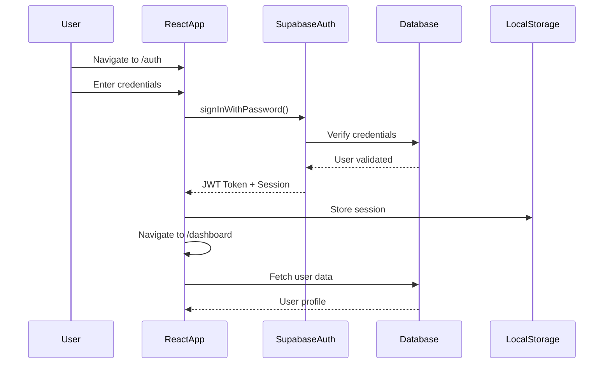

### Data Fetching Flow (with React Query)

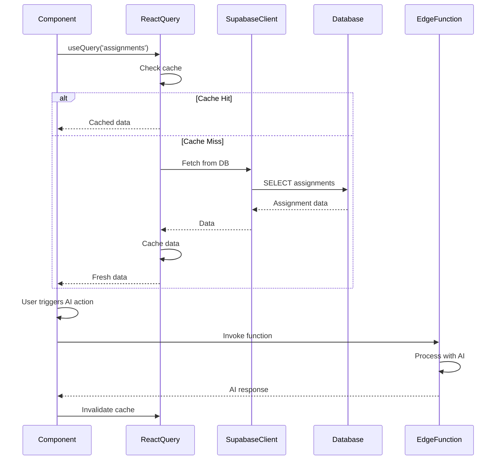

### Real-time Updates Flow

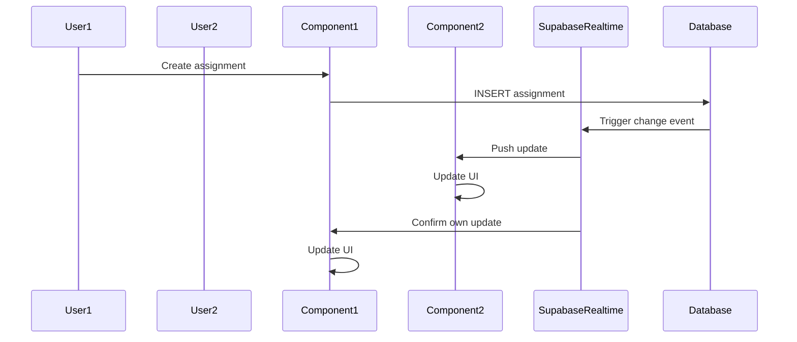

---

## Authentication & Authorization

### Authentication Architecture

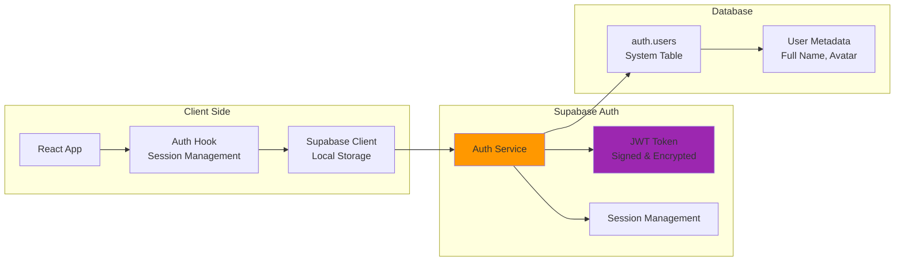

### Row Level Security (RLS) Policies

All tables implement RLS with policies like:

```sql
-- Example: Assignments table
CREATE POLICY "Users can view own assignments"
ON assignments FOR SELECT
USING (auth.uid() = user_id);

CREATE POLICY "Users can insert own assignments"
ON assignments FOR INSERT
WITH CHECK (auth.uid() = user_id);

CREATE POLICY "Users can update own assignments"
ON assignments FOR UPDATE
USING (auth.uid() = user_id);

CREATE POLICY "Users can delete own assignments"
ON assignments FOR DELETE
USING (auth.uid() = user_id);
```

### Authorization Flow

1. User authenticates → Receives JWT token
2. Token included in all Supabase requests (automatic via client)
3. Database RLS policies validate `auth.uid()` matches `user_id`
4. Edge Functions can verify tokens via Supabase Admin API
5. Real-time subscriptions automatically filter by user permissions

---

## Component Structure

### Feature Components by Domain

#### Academics Domain
- `AssignmentForm` - Create/edit assignments
- `AssignmentList` - Display assignments with filters
- `AssignmentCalendar` - Calendar view of assignments
- `PomodoroTimer` - Focus timer for studying
- `AiNoteGenerator` - Generate study notes from content

#### Mental Health Domain
- `MoodTracker` - Log daily moods
- `MoodChart` - Visualize mood trends over time
- Meditation audio support

#### Career Domain
- `QuizGame` - Career assessment quiz
- `ResumeBuilder` - Create and export resumes

#### Social Domain
- `GroupList` - Manage study/social groups
- `GroupChat` - Real-time group messaging
- `GroupEvents` - Plan group activities
- `GroupAvailability` - Coordinate schedules
- `UserAvailability` - Set personal availability

#### Shared Components
- `AiChatDialog` - Floating AI assistant
- `NewsCarousel` - News article display

### UI Component Library (shadcn/ui)

40+ reusable components including:
- Layout: Card, Separator, ScrollArea, Resizable
- Forms: Input, Textarea, Select, Checkbox, Radio
- Overlays: Dialog, Sheet, Popover, Tooltip, Alert Dialog
- Navigation: Tabs, Breadcrumb, Navigation Menu, Sidebar
- Feedback: Toast, Alert, Progress, Skeleton
- Data Display: Table, Calendar, Chart, Avatar, Badge
- Interactive: Button, Switch, Slider, Toggle

---

## API Integrations

### External API Usage

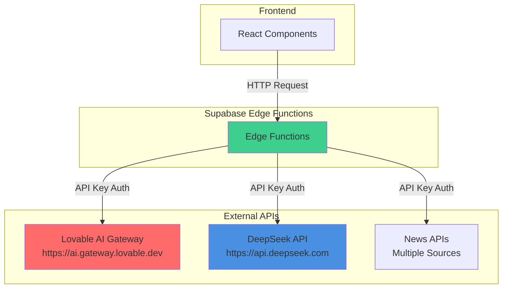

### API Configuration

- **Environment Variables**: API keys stored in Supabase secrets
- **CORS**: Edge functions handle CORS headers
- **Error Handling**: Comprehensive error responses
- **Rate Limiting**: Handled by external providers (429 responses)
- **Streaming**: SSE support for real-time AI responses

---

## Deployment Architecture

### Build & Deployment Flow

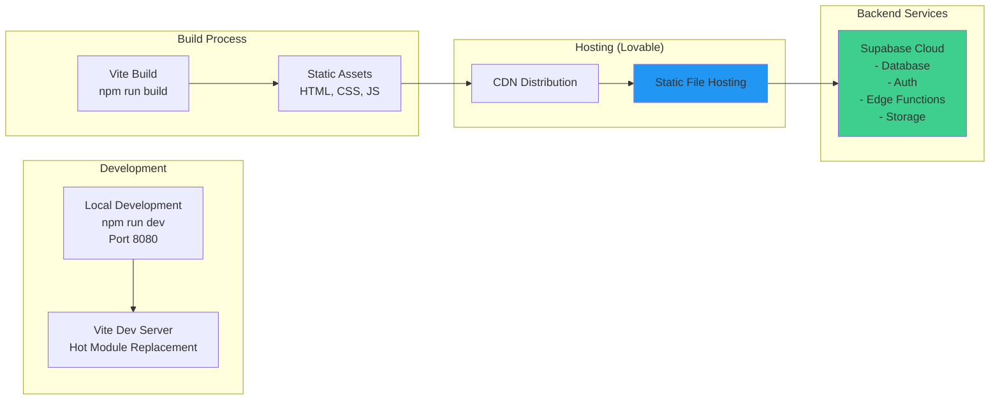

### Environment Configuration

- **Frontend**: Environment variables via `import.meta.env`
  - `VITE_SUPABASE_URL`
  - `VITE_SUPABASE_PUBLISHABLE_KEY`

- **Backend**: Environment variables via Deno `Deno.env.get()`
  - `LOVABLE_API_KEY`
  - `DEEPSEEK_API_KEY`
  - Supabase service role key (for admin operations)

### Deployment Considerations

1. **Frontend**: Static site hosting (CDN)
2. **Backend**: Serverless Edge Functions (automatically deployed)
3. **Database**: Managed PostgreSQL (Supabase)
4. **Scaling**: Automatic for Edge Functions, database scaling via Supabase plan
5. **Security**: HTTPS enforced, CORS configured, RLS enabled

---

## File Structure Summary

```
stonepath-ai-hub-main/
├── src/
│   ├── App.tsx                 # Root component, routing setup
│   ├── main.tsx                # Entry point
│   ├── index.css               # Global styles
│   ├── pages/                  # Route components
│   │   ├── Index.tsx
│   │   ├── Auth.tsx
│   │   ├── Dashboard.tsx
│   │   ├── Academics.tsx
│   │   ├── Career.tsx
│   │   ├── MentalHealth.tsx
│   │   ├── Friendships.tsx
│   │   ├── Relationships.tsx
│   │   ├── Bullying.tsx
│   │   ├── Fitness.tsx
│   │   ├── Finance.tsx
│   │   └── TaskPlanner.tsx
│   ├── components/             # Feature components
│   │   ├── ui/                 # shadcn/ui components (40+)
│   │   └── [15 feature components]
│   ├── hooks/                  # Custom React hooks
│   ├── integrations/
│   │   └── supabase/
│   │       ├── client.ts       # Supabase client setup
│   │       └── types.ts        # Generated DB types
│   └── lib/
│       └── utils.ts            # Utility functions
├── supabase/
│   ├── functions/              # Edge Functions (14)
│   └── migrations/             # Database migrations (15)
├── public/                     # Static assets
├── package.json
├── vite.config.ts
├── tailwind.config.ts
└── tsconfig.json
```

---

## Key Architectural Decisions

1. **Supabase as BaaS**: Eliminates need for separate backend server, provides auth, database, and serverless functions
2. **React Query**: Efficient data fetching, caching, and synchronization
3. **shadcn/ui**: Accessible, customizable component library
4. **TypeScript**: Type safety across frontend and generated DB types
5. **Edge Functions**: Serverless AI processing close to users
6. **RLS**: Database-level security ensures data isolation
7. **Real-time**: WebSocket connections for live updates (groups, chat)
8. **Streaming AI**: SSE for real-time AI responses

---

## Future Enhancements

- [ ] Mobile app (React Native)
- [ ] Offline support (PWA)
- [ ] Advanced analytics dashboard
- [ ] Multi-language support
- [ ] Integration with school systems
- [ ] Advanced AI features (personalized recommendations)
- [ ] Video/voice chat for groups
- [ ] File upload and sharing

---

## Security Considerations

1. **Authentication**: JWT tokens with automatic refresh
2. **Authorization**: Row Level Security on all tables
3. **API Keys**: Stored as environment secrets, never exposed to client
4. **CORS**: Configured for specific origins
5. **Input Validation**: Zod schemas on frontend, validation in Edge Functions
6. **HTTPS**: Enforced for all connections
7. **Rate Limiting**: Handled by external API providers

---

*Last Updated: Based on current codebase structure*
*Version: 1.0.0*

