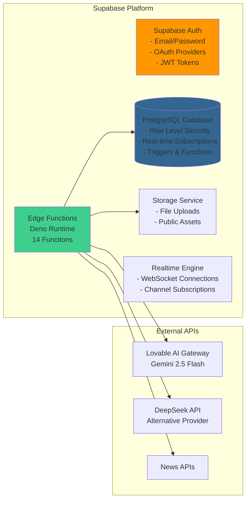
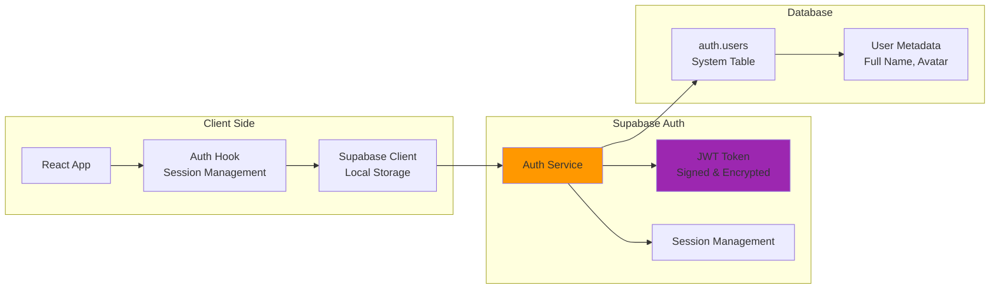
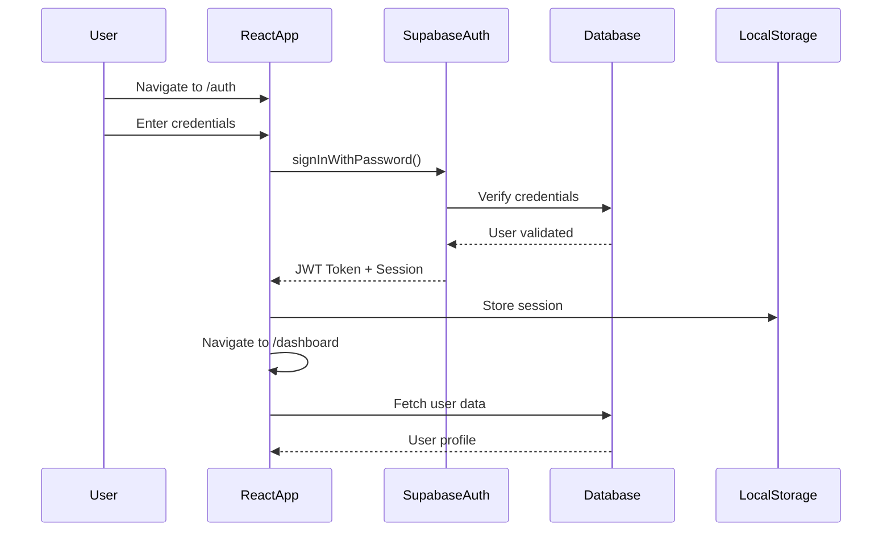
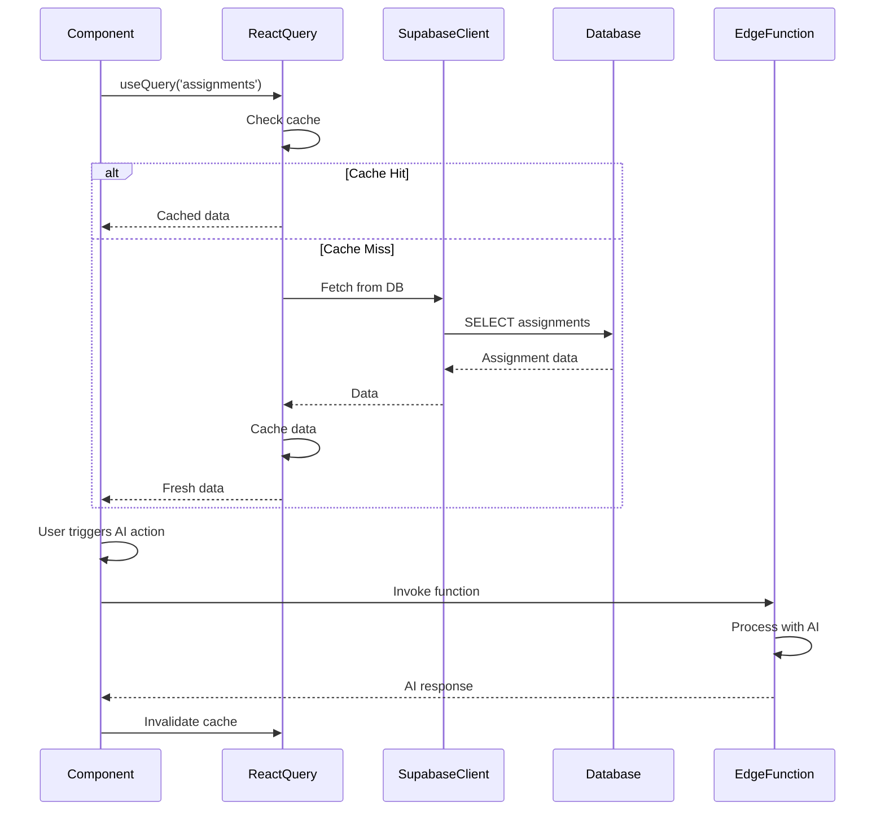
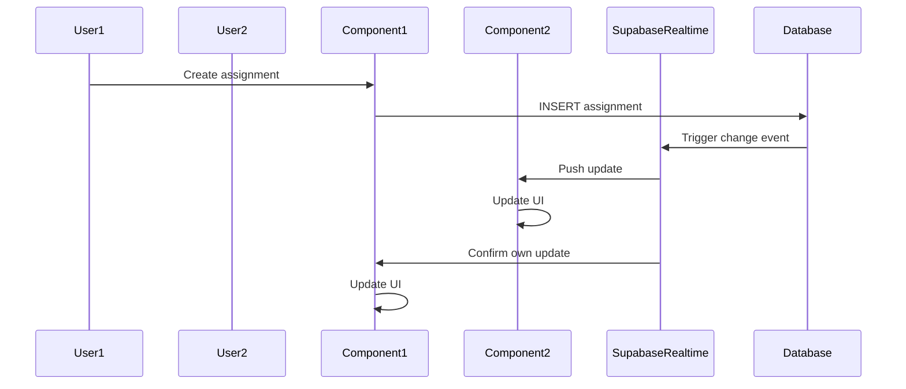
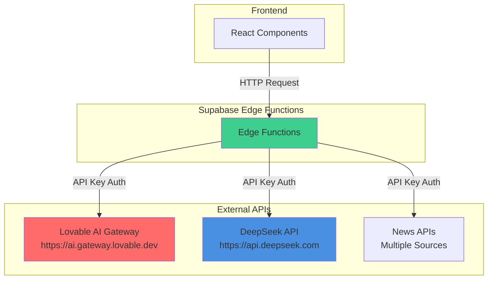
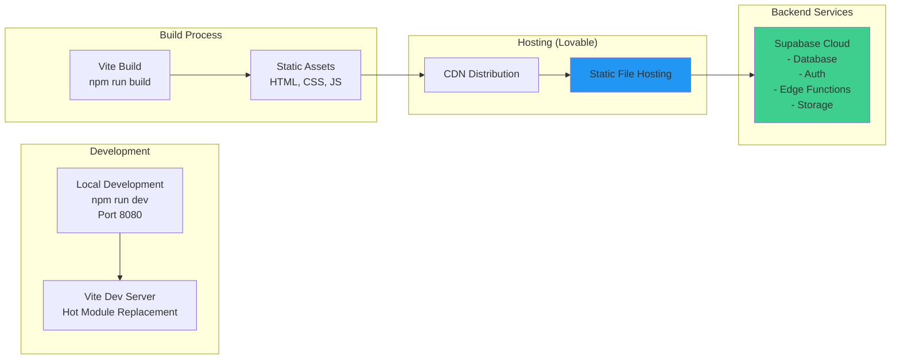

# Backend Architecture Documentation

This document covers the backend services, Supabase platform, Edge Functions, API integrations, authentication, and deployment architecture.

## Supabase Platform

## Edge Functions

### Function Inventory

```mermaid
graph TB
    subgraph "AI-Powered Functions"
        AI_CHAT[ai-chat<br/>General AI Assistant<br/>Streaming Responses]
        GENERATE_NOTES[generate-notes<br/>Educational Content<br/>Bullets/Flashcards/Mindmaps]
        GENERATE_QUIZ[generate-quiz<br/>Quiz Generation<br/>Multiple Choice Questions]
        GENERATE_QUIZ_IMAGE[generate-quiz-image<br/>Image-based Quizzes]
        INTERVIEW_COACH[interview-coach<br/>Career Interview Practice]
        GENERATE_CAREER_DETAILS[generate-career-details<br/>Career Information]
        GENERATE_CAREER_INSIGHTS[generate-career-insights<br/>Career Analysis]
        MOOD_TTS[mood-tts<br/>Text-to-Speech<br/>Mood Support]
    end

    subgraph "Content Generation"
        GENERATE_NEWS[generate-news<br/>AI News Articles]
        FETCH_REAL_NEWS[fetch-real-news<br/>Real News Aggregation]
        GENERATE_RECIPE[generate-recipe<br/>Recipe Suggestions]
        GENERATE_ZODIAC[generate-zodiac-wellness<br/>Wellness Tips]
        GENERATE_MOOD_TIPS[generate-mood-tips<br/>Mental Health Tips]
    end

    subgraph "Providers"
        LOVABLE[Lovable AI<br/>Gemini 2.5 Flash]
        DEEPSEEK[DeepSeek API<br/>Alternative Provider]
        NEWS_API[News APIs]
    end

    AI_CHAT --> LOVABLE
    AI_CHAT --> DEEPSEEK
    GENERATE_NOTES --> LOVABLE
    GENERATE_QUIZ --> LOVABLE
    GENERATE_QUIZ_IMAGE --> LOVABLE
    INTERVIEW_COACH --> LOVABLE
    GENERATE_CAREER_DETAILS --> LOVABLE
    GENERATE_CAREER_INSIGHTS --> LOVABLE
    
    GENERATE_NEWS --> LOVABLE
    FETCH_REAL_NEWS --> NEWS_API
    GENERATE_RECIPE --> LOVABLE
    GENERATE_ZODIAC --> LOVABLE
    GENERATE_MOOD_TIPS --> LOVABLE
    MOOD_TTS --> LOVABLE

    style AI_CHAT fill:#3ecf8e
    style LOVABLE fill:#ff6b6b
    style DEEPSEEK fill:#4a90e2
```

### Edge Function Details

| Function | Purpose | AI Provider | Output Format |
|----------|---------|-------------|---------------|
| `ai-chat` | General AI assistant with context awareness | Lovable/DeepSeek | Streaming SSE |
| `generate-notes` | Convert content to study materials (bullets, flashcards, mindmaps) | Lovable | JSON/Text |
| `generate-quiz` | Create quizzes from educational content | Lovable | JSON |
| `generate-quiz-image` | Image-based quiz generation | Lovable | JSON |
| `interview-coach` | Interview practice questions and feedback | Lovable | Streaming SSE |
| `generate-career-details` | Career information retrieval | Lovable | JSON |
| `generate-career-insights` | Career analysis & recommendations | Lovable | JSON |
| `mood-tts` | Text-to-speech for mood support | Lovable | Audio/Text |
| `generate-news` | AI-generated news articles | Lovable | JSON |
| `fetch-real-news` | Real news aggregation from external APIs | External APIs | JSON |
| `generate-recipe` | Recipe suggestions based on preferences | Lovable | JSON |
| `generate-zodiac-wellness` | Zodiac-based wellness tips | Lovable | JSON |
| `generate-mood-tips` | Mental health tips and guidance | Lovable | JSON |

### Function Locations

All Edge Functions are located in `supabase/functions/`:
- Each function has its own directory with `index.ts`
- Functions use Deno runtime
- Functions handle CORS headers automatically
- Environment variables stored in Supabase secrets

## Authentication & Authorization

### Authentication Architecture

### Authentication Flow

1. User enters credentials on `/auth` page
2. Supabase Auth validates credentials
3. JWT token issued and stored in localStorage
4. Token automatically included in all Supabase requests
5. Token refresh handled automatically
6. Session persists across browser sessions

### Authorization Flow

1. User authenticates → Receives JWT token
2. Token included in all Supabase requests (automatic via client)
3. Database RLS policies validate `auth.uid()` matches `user_id`
4. Edge Functions can verify tokens via Supabase Admin API
5. Real-time subscriptions automatically filter by user permissions

### Row Level Security (RLS)

All tables implement RLS with policies ensuring:
- Users can only access their own data
- Group members can access group-related data
- Anonymous tables allow public read access where appropriate
- Policies use `auth.uid()` to identify the current user

## Data Flow

### Authentication Flow

### Data Fetching Flow (with React Query)

### Real-time Updates Flow

## API Integrations

### External API Usage

### API Configuration

- **Environment Variables**: API keys stored in Supabase secrets, never exposed to client
- **CORS**: Edge functions handle CORS headers for cross-origin requests
- **Error Handling**: Comprehensive error responses with appropriate status codes
- **Rate Limiting**: Handled by external providers (429 responses)
- **Streaming**: SSE (Server-Sent Events) support for real-time AI responses

### AI Providers

#### Lovable AI Gateway
- **Model**: Google Gemini 2.5 Flash
- **Endpoint**: `https://ai.gateway.lovable.dev/v1/chat/completions`
- **Authentication**: Bearer token via `LOVABLE_API_KEY`
- **Features**: Streaming responses, context awareness

#### DeepSeek API
- **Model**: deepseek-chat
- **Endpoint**: `https://api.deepseek.com/v1/chat/completions`
- **Authentication**: Bearer token via `DEEPSEEK_API_KEY`
- **Features**: Alternative provider, streaming support

## Deployment Architecture

### Build & Deployment Flow

### Environment Configuration

#### Frontend
Environment variables via `import.meta.env`:
- `VITE_SUPABASE_URL` - Supabase project URL
- `VITE_SUPABASE_PUBLISHABLE_KEY` - Public anon key

#### Backend (Edge Functions)
Environment variables via Deno `Deno.env.get()`:
- `LOVABLE_API_KEY` - Lovable AI API key
- `DEEPSEEK_API_KEY` - DeepSeek API key (optional)
- Supabase service role key (for admin operations)

### Deployment Considerations

1. **Frontend**: Static site hosting via CDN
2. **Backend**: Serverless Edge Functions (automatically deployed with Supabase)
3. **Database**: Managed PostgreSQL (Supabase)
4. **Scaling**: 
   - Automatic for Edge Functions
   - Database scaling via Supabase plan
   - CDN handles frontend traffic
5. **Security**: 
   - HTTPS enforced
   - CORS configured
   - RLS enabled on all tables
   - API keys stored as secrets

## Security Considerations

1. **Authentication**: JWT tokens with automatic refresh
2. **Authorization**: Row Level Security on all tables
3. **API Keys**: Stored as environment secrets, never exposed to client
4. **CORS**: Configured for specific origins in Edge Functions
5. **Input Validation**: Zod schemas on frontend, validation in Edge Functions
6. **HTTPS**: Enforced for all connections
7. **Rate Limiting**: Handled by external API providers (429 responses)
8. **SQL Injection**: Prevented via parameterized queries in Supabase client

---

[← Back to Architecture Overview](ARCHITECTURE.md)

