# Database Schema Documentation

This document provides a comprehensive overview of the Stone Path AI Hub database schema, including all tables, relationships, and database features.

## Complete Database Schema

```mermaid
erDiagram
    USERS ||--o{ ASSIGNMENTS : creates
    USERS ||--o{ MOOD_ENTRIES : tracks
    USERS ||--o{ BUDGET_CATEGORIES : manages
    USERS ||--o{ TRANSACTIONS : records
    USERS ||--o{ CAREER_QUIZ_RESULTS : takes
    USERS ||--o{ GROUPS : creates
    USERS ||--o{ GROUP_MEMBERS : joins
    USERS ||--o{ USER_AVAILABILITY : sets
    USERS ||--o{ WORKOUT_LOGS : logs
    USERS ||--o{ FITNESS_STREAKS : tracks
    USERS ||--o{ CHORES : creates
    USERS ||--o{ CHORE_COMPLETIONS : completes
    USERS ||--o{ SAVINGS_GOALS : sets
    USERS ||--o{ PROFILES : has
    USERS ||--o{ COUNSELOR_REQUESTS : requests
    USERS ||--o{ MENTOR_REQUESTS : requests
    
    GROUPS ||--o{ GROUP_MEMBERS : contains
    GROUPS ||--o{ GROUP_MESSAGES : has
    GROUPS ||--o{ GROUP_EVENTS : has
    
    GROUP_EVENTS ||--o{ EVENT_RSVPS : receives
    
    BUDGET_CATEGORIES ||--o{ TRANSACTIONS : categorizes
    
    CHORES ||--o{ CHORE_COMPLETIONS : tracks
    
    ASSIGNMENTS {
        uuid id PK
        uuid user_id FK
        string title
        string description
        timestamp due_date
        string subject
        string priority
        string status
        string type
        timestamp created_at
        timestamp updated_at
    }
    
    MOOD_ENTRIES {
        uuid id PK
        uuid user_id FK
        integer mood_level "0-6"
        text_array feelings
        text_array impact_factors
        timestamp created_at
    }
    
    BUDGET_CATEGORIES {
        uuid id PK
        uuid user_id FK
        string name
        string type
        decimal monthly_budget
        string color
        timestamp created_at
    }
    
    TRANSACTIONS {
        uuid id PK
        uuid user_id FK
        uuid category_id FK
        decimal amount
        string description
        string type
        date transaction_date
        timestamp created_at
    }
    
    CAREER_QUIZ_RESULTS {
        uuid id PK
        uuid user_id FK
        jsonb answers
        string result_type
        text feedback
        jsonb recommended_careers
        jsonb recommended_clubs
        text quote
        timestamp created_at
    }
    
    GROUPS {
        uuid id PK
        uuid created_by FK
        string name
        string category
        text description
        boolean is_public
        integer max_members
        timestamp created_at
        timestamp updated_at
    }
    
    GROUP_MEMBERS {
        uuid id PK
        uuid group_id FK
        uuid user_id FK
        string role "admin, member"
        timestamp joined_at
    }
    
    GROUP_MESSAGES {
        uuid id PK
        uuid group_id FK
        uuid user_id FK
        text content
        string image_url
        boolean is_moderated
        timestamp created_at
    }
    
    GROUP_EVENTS {
        uuid id PK
        uuid group_id FK
        uuid created_by FK
        string title
        text description
        timestamp event_date
        string location
        timestamp created_at
        timestamp updated_at
    }
    
    EVENT_RSVPS {
        uuid id PK
        uuid event_id FK
        uuid user_id FK
        string status "going, maybe, not_going"
        timestamp created_at
    }
    
    BULLYING_REPORTS {
        uuid id PK
        string incident_type
        text description
        boolean is_urgent
        string status
        timestamp created_at
    }
    
    MENTOR_REQUESTS {
        uuid id PK
        uuid user_id FK
        string request_type
        text description
        string status
        timestamp created_at
    }
    
    COUNSELOR_REQUESTS {
        uuid id PK
        uuid user_id FK
        string reason
        text description
        string urgency_level
        string preferred_contact
        string status
        timestamp created_at
    }
    
    USER_AVAILABILITY {
        uuid id PK
        uuid user_id FK
        integer day_of_week "0-6"
        time start_time
        time end_time
        date week_start_date
        text notes
        timestamp created_at
        timestamp updated_at
    }
    
    WORKOUT_LOGS {
        uuid id PK
        uuid user_id FK
        date workout_date
        string workout_type
        integer duration_minutes
        string intensity
        text notes
        timestamp created_at
    }
    
    FITNESS_STREAKS {
        uuid id PK
        uuid user_id FK
        integer current_streak
        integer longest_streak
        date last_workout_date
        timestamp updated_at
    }
    
    CHORES {
        uuid id PK
        uuid user_id FK
        string title
        text description
        string frequency
        decimal allowance_amount
        boolean is_active
        timestamp created_at
    }
    
    CHORE_COMPLETIONS {
        uuid id PK
        uuid chore_id FK
        uuid user_id FK
        date completed_date
        boolean is_paid
        text notes
        timestamp created_at
    }
    
    SAVINGS_GOALS {
        uuid id PK
        uuid user_id FK
        string goal_name
        decimal target_amount
        decimal current_amount
        date target_date
        timestamp created_at
    }
    
    RELATIONSHIP_QUESTIONS {
        uuid id PK
        text question
        text answer
        boolean is_approved
        timestamp created_at
    }
    
    PROFILES {
        uuid id PK
        uuid user_id FK
        string full_name
        timestamp created_at
        timestamp updated_at
    }
```



## Complete Table Inventory

The database contains **20 tables** organized by domain:

### Academics Domain
- **assignments**: Student assignments and homework tracking
  - Fields: title, description, due_date, subject, priority, status, type
  - Relations: user_id → users

### Mental Health Domain
- **mood_entries**: Daily mood tracking with feelings and impact factors
  - Fields: mood_level (0-6), feelings (array), impact_factors (array)
  - Relations: user_id → users
- **counselor_requests**: Requests for counselor sessions
  - Fields: reason, description, urgency_level, preferred_contact, status
  - Relations: user_id → users

### Career Domain
- **career_quiz_results**: Career assessment quiz results
  - Fields: answers (JSONB), result_type, feedback, recommended_careers (JSONB), recommended_clubs (JSONB), quote
  - Relations: user_id → users

### Social/Friendships Domain
- **groups**: Study/social groups
  - Fields: name, category, description, is_public, max_members, created_by
  - Relations: created_by → users
- **group_members**: Group membership with roles
  - Fields: role (admin/member), joined_at
  - Relations: group_id → groups, user_id → users
- **group_messages**: Real-time group chat messages
  - Fields: content, image_url, is_moderated
  - Relations: group_id → groups, user_id → users
- **group_events**: Group events and activities
  - Fields: title, description, event_date, location
  - Relations: group_id → groups, created_by → users
- **event_rsvps**: Event RSVPs
  - Fields: status (going/maybe/not_going)
  - Relations: event_id → group_events, user_id → users
- **user_availability**: User availability scheduling
  - Fields: day_of_week (0-6), start_time, end_time, week_start_date, notes
  - Relations: user_id → users
- **mentor_requests**: Mentor matching requests
  - Fields: request_type, description, status
  - Relations: user_id → users

### Relationships Domain
- **relationship_questions**: Anonymous Q&A about relationships
  - Fields: question, answer, is_approved
  - No user relation (anonymous)

### Bullying/Peer Support Domain
- **bullying_reports**: Anonymous bullying incident reports
  - Fields: incident_type, description, is_urgent, status
  - No user relation (anonymous)

### Fitness Domain
- **workout_logs**: Workout tracking
  - Fields: workout_date, workout_type, duration_minutes, intensity, notes
  - Relations: user_id → users
- **fitness_streaks**: Fitness streak tracking
  - Fields: current_streak, longest_streak, last_workout_date
  - Relations: user_id → users

### Finance Domain
- **budget_categories**: Budget category management
  - Fields: name, type, monthly_budget, color
  - Relations: user_id → users
- **transactions**: Financial transaction records
  - Fields: amount, description, type, transaction_date
  - Relations: user_id → users, category_id → budget_categories
- **chores**: Chore/allowance management
  - Fields: title, description, frequency, allowance_amount, is_active
  - Relations: user_id → users
- **chore_completions**: Chore completion tracking
  - Fields: completed_date, is_paid, notes
  - Relations: chore_id → chores, user_id → users
- **savings_goals**: Savings goal tracking
  - Fields: goal_name, target_amount, current_amount, target_date
  - Relations: user_id → users

### User Management
- **profiles**: Extended user profile information
  - Fields: full_name
  - Relations: user_id → users (Supabase auth.users)

## Database Functions

- **is_group_member(_group_id, _user_id)**: Helper function to check group membership
  - Returns: boolean
  - Used in RLS policies for secure group access

## Key Database Features

### Row Level Security (RLS)
All tables have RLS enabled with policies ensuring users can only access their own data or public/shared resources. Example policy:

```sql
-- Example: Assignments table
CREATE POLICY "Users can view own assignments"
ON assignments FOR SELECT
USING (auth.uid() = user_id);

CREATE POLICY "Users can insert own assignments"
ON assignments FOR INSERT
WITH CHECK (auth.uid() = user_id);

CREATE POLICY "Users can update own assignments"
ON assignments FOR UPDATE
USING (auth.uid() = user_id);

CREATE POLICY "Users can delete own assignments"
ON assignments FOR DELETE
USING (auth.uid() = user_id);
```

### Performance Optimizations
- **Indexes**: Strategic indexes on foreign keys and frequently queried columns for performance
- **Foreign Key Constraints**: Enforced relationships between tables
- **Check Constraints**: Data validation (e.g., mood_level 0-6)

### Data Types
- **UUID Primary Keys**: All tables use UUID for better distributed system compatibility
- **JSONB Columns**: Used for flexible data storage (quiz answers, career recommendations, clubs)
- **Array Columns**: PostgreSQL arrays used for mood feelings and impact factors
- **Timestamps**: Automatic `created_at` and `updated_at` timestamps on relevant tables

### Privacy Features
- **Anonymous Tables**: Some tables (bullying_reports, relationship_questions) don't link to users for privacy
- **RLS Policies**: Database-level security ensures data isolation between users
- **Moderation Flags**: Group messages include `is_moderated` flag for content moderation

## Migration Files

Database schema is managed through Supabase migrations located in `supabase/migrations/`. There are currently 15 migration files that build up the complete schema.

---

[← Back to Architecture Overview](ARCHITECTURE.md)

