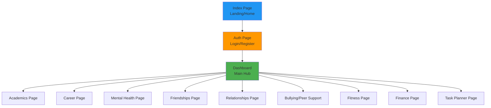

# Frontend Architecture Documentation

This document covers the frontend architecture, component structure, pages, and user interface design of the Stone Path AI Hub.

## Page Structure



## Component Hierarchy

```mermaid
graph TB
    subgraph "App Level"
        App[App.tsx<br/>Root Component]
        Router[React Router]
        QueryProvider[QueryClientProvider]
        ToastProvider[Toast Providers]
    end

    subgraph "Pages"
        Dashboard
        Academics
        Career
        MentalHealth
        Friendships
        Relationships
        Bullying
        Fitness
        Finance
        TaskPlanner
    end

    subgraph "Feature Components"
        AiChatDialog[AI Chat Dialog]
        AssignmentForm[Assignment Form]
        AssignmentList[Assignment List]
        AssignmentCalendar[Assignment Calendar]
        PomodoroTimer[Pomodoro Timer]
        AiNoteGenerator[AI Note Generator]
        MoodTracker[Mood Tracker]
        MoodChart[Mood Chart]
        QuizGame[Quiz Game]
        ResumeBuilder[Resume Builder]
        NewsCarousel[News Carousel]
        GroupList[Group List]
        GroupChat[Group Chat]
        GroupEvents[Group Events]
        GroupAvailability[Group Availability]
        UserAvailability[User Availability]
    end

    subgraph "UI Components (shadcn/ui)"
        UI[40+ UI Components<br/>Button, Card, Dialog, etc.]
    end

    App --> Router
    App --> QueryProvider
    App --> ToastProvider
    
    Router --> Dashboard
    Router --> Academics
    Router --> Career
    Router --> MentalHealth
    Router --> Friendships
    Router --> Relationships
    Router --> Bullying
    Router --> Fitness
    Router --> Finance
    Router --> TaskPlanner
    
    Dashboard --> AiChatDialog
    Dashboard --> NewsCarousel
    
    Academics --> AssignmentForm
    Academics --> AssignmentList
    Academics --> AssignmentCalendar
    Academics --> PomodoroTimer
    Academics --> AiNoteGenerator
    
    MentalHealth --> MoodTracker
    MentalHealth --> MoodChart
    
    Career --> QuizGame
    Career --> ResumeBuilder
    
    Friendships --> GroupList
    Friendships --> GroupChat
    Friendships --> GroupEvents
    Friendships --> GroupAvailability
    
    FeatureComponents --> UI

    style App fill:#61dafb
    style Dashboard fill:#4CAF50
    style UI fill:#9C27B0
```



## Pages

### Core Pages
- **Index.tsx** - Landing page with feature overview
- **Auth.tsx** - Authentication (login/register)
- **Dashboard.tsx** - Main hub with pillar navigation and daily affirmations
- **NotFound.tsx** - 404 error page

### Feature Pages
- **Academics.tsx** - Assignment management and study tools
- **Career.tsx** - Career assessment and resume building
- **MentalHealth.tsx** - Mood tracking and wellness resources
- **Friendships.tsx** - Group management and social features
- **Relationships.tsx** - Relationship guidance and Q&A
- **Bullying.tsx** - Peer support and anonymous reporting
- **Fitness.tsx** - Workout logging and streak tracking
- **Finance.tsx** - Budget management and financial tracking
- **TaskPlanner.tsx** - General task planning

## Feature Components by Domain

### Academics Domain
- **AssignmentForm** - Create/edit assignments with validation
- **AssignmentList** - Display assignments with filters and sorting
- **AssignmentCalendar** - Calendar view of assignments
- **PomodoroTimer** - Focus timer for studying sessions
- **AiNoteGenerator** - Generate study notes from content (bullets, flashcards, mindmaps)

### Mental Health Domain
- **MoodTracker** - Log daily moods with feelings and impact factors
- **MoodChart** - Visualize mood trends over time using Recharts
- Meditation audio support

### Career Domain
- **QuizGame** - Interactive career assessment quiz
- **ResumeBuilder** - Create and export professional resumes

### Social Domain
- **GroupList** - Browse and manage study/social groups
- **GroupChat** - Real-time group messaging with moderation
- **GroupEvents** - Plan and manage group activities
- **GroupAvailability** - Coordinate schedules within groups
- **UserAvailability** - Set personal availability for scheduling

### Shared Components
- **AiChatDialog** - Floating AI assistant with streaming responses
- **NewsCarousel** - Display news articles with carousel navigation

## UI Component Library (shadcn/ui)

The project uses **40+ reusable components** from shadcn/ui, built on Radix UI primitives:

### Layout Components
- Card, Separator, ScrollArea, Resizable, Aspect Ratio

### Form Components
- Input, Textarea, Select, Checkbox, Radio Group, Switch, Slider
- Label, Form (React Hook Form integration)

### Overlay Components
- Dialog, Sheet, Popover, Tooltip, Alert Dialog, Hover Card, Drawer

### Navigation Components
- Tabs, Breadcrumb, Navigation Menu, Sidebar, Menubar, Command (Cmd+K)

### Feedback Components
- Toast (Sonner), Alert, Progress, Skeleton

### Data Display Components
- Table, Calendar, Chart, Avatar, Badge, Accordion, Collapsible

### Interactive Components
- Button, Toggle, Toggle Group, Switch, Slider

## State Management

### TanStack Query (React Query)
- **Data Fetching**: Automatic caching and refetching
- **Optimistic Updates**: Immediate UI updates before server confirmation
- **Cache Invalidation**: Smart cache management
- **Background Updates**: Automatic data synchronization

### Local Component State
- **React Hooks**: useState, useEffect, useReducer
- **Form State**: React Hook Form for form management
- **UI State**: Local state for UI interactions (modals, toggles, etc.)

## Routing

React Router DOM handles client-side routing:
- **Browser Router**: HTML5 history API routing
- **Protected Routes**: Authentication checks before page access
- **Route Parameters**: Dynamic routing for resource IDs
- **Navigation**: Programmatic navigation via `useNavigate` hook

## Styling

### Tailwind CSS
- Utility-first CSS framework
- Custom color palette and design tokens
- Responsive design utilities
- Dark mode support via `next-themes`

### Custom Styles
- Global styles in `index.css`
- Component-specific styles via Tailwind classes
- Animation utilities via `tailwindcss-animate`

## Form Handling

### React Hook Form + Zod
- **Schema Validation**: Zod schemas for type-safe validation
- **Form State Management**: React Hook Form for efficient form handling
- **Error Handling**: Automatic error display and validation messages
- **Integration**: Seamless integration with shadcn/ui form components

## Data Visualization

### Recharts
- Mood trend charts
- Budget analytics
- Fitness progress visualization
- Responsive and interactive charts

## Real-time Features

### Supabase Realtime
- **Group Chat**: Real-time messaging via WebSocket subscriptions
- **Live Updates**: Automatic UI updates when data changes
- **Channel Subscriptions**: Subscribe to specific database tables
- **Presence**: Track user presence in groups

## File Structure

```
src/
├── App.tsx                 # Root component, routing setup
├── main.tsx                # Entry point, React DOM render
├── index.css               # Global styles, Tailwind imports
├── pages/                  # Route components
│   ├── Index.tsx
│   ├── Auth.tsx
│   ├── Dashboard.tsx
│   ├── Academics.tsx
│   ├── Career.tsx
│   ├── MentalHealth.tsx
│   ├── Friendships.tsx
│   ├── Relationships.tsx
│   ├── Bullying.tsx
│   ├── Fitness.tsx
│   ├── Finance.tsx
│   └── TaskPlanner.tsx
├── components/             # Feature components
│   ├── ui/                 # shadcn/ui components (40+)
│   ├── AiChatDialog.tsx
│   ├── AssignmentForm.tsx
│   ├── AssignmentList.tsx
│   ├── AssignmentCalendar.tsx
│   ├── PomodoroTimer.tsx
│   ├── AiNoteGenerator.tsx
│   ├── MoodTracker.tsx
│   ├── MoodChart.tsx
│   ├── QuizGame.tsx
│   ├── ResumeBuilder.tsx
│   ├── NewsCarousel.tsx
│   ├── GroupList.tsx
│   ├── GroupChat.tsx
│   ├── GroupEvents.tsx
│   ├── GroupAvailability.tsx
│   └── UserAvailability.tsx
├── hooks/                  # Custom React hooks
│   ├── use-mobile.tsx
│   └── use-toast.ts
├── integrations/
│   └── supabase/
│       ├── client.ts       # Supabase client setup
│       └── types.ts        # Generated DB types
└── lib/
    └── utils.ts            # Utility functions (cn, etc.)
```

## Key Architectural Decisions

1. **Component-Based Architecture**: Modular, reusable components
2. **Type Safety**: TypeScript throughout for compile-time safety
3. **Performance**: React Query for efficient data fetching and caching
4. **Accessibility**: Radix UI primitives ensure WCAG compliance
5. **Developer Experience**: Hot Module Replacement for fast development
6. **Code Organization**: Clear separation between pages, components, hooks, and utilities

---

[← Back to Architecture Overview](ARCHITECTURE.md)

